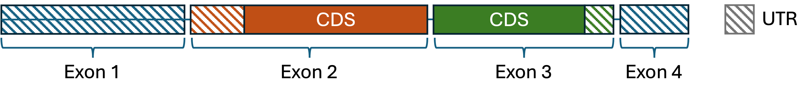

______________________________________________________________________

## icon: lucide/folder-kanban

# Annotation Guide

The SURF-A package is inteded to call uORF regions from 5'UTR sequence. This page outlines the conceptual basis for the uORF region calling and also outlines how special cases (such as N-terminal extensions) are currently handed.

# Abbreviations

- Coding DNA sequence (CDS)
- Gene Transfer Format (GTF)
- Untranslated Region (UTR)
- Upstream open reading frame (uORF)

# Transcript Definitions

GTF files outline numerous regions relevant to transcript expression. These include entire transcript boundaries as well as exons and UTRs. A transcript is made up of exons, while UTRs and CDS boundaries fall within and across the various exon boundaries. While UTRs are relatively short compared to the overall transcript, they can fall across multiple exons as in the example below (Figure 1). The CDS begins where a 5'UTR UTR ends. The 3'UTR begins where the CDS ends.

{ align=left }

**Figure 1. Exons, UTRs and CDS.** A hypothetical transcript made of 4 exons shows the difference between exon, UTR, and DS boundaries. The 5'UTR is the first set of transcript sequence which preceeds the CDS start.

To generate a FASTA sequence to use for calling uORF boundaries, the SURF-A library gathers the 5' noncoding exons (defined as any exons containing the 5'UTR sequence). The 5' noncoding exons in the Figure 1 example are exons 1 and 2.

The SURF-A package is specifically intended to identify regions in the 5'UTR and as such, open reading frames which occur elsewhere in the transcript or gene (such as the 3'UTR) are not annotated by SURF-A at this time. If a uORF reads into the downstream CDS without encountering a stop codon, it is simply labeled as "NO_UTR_STOP."

# How are UTRs Represented in SURF-A?

{ align=left }
**Figure 2. Two example transcripts.** On top, Transcript 1 is a positive strand transcript with a single exon which is shared between the untranslated region (UTR) and the coding sequence (CDS). On bottom, Transcript 2 is a negative stand transcript with two exons. The first exon is entirely noncoding, while the second transcript is shared between the UTR and CDS.

We can also represent these trascript boundaries in table form.

| Transcript | UTR Length (bp) | Strand | Exon | Start| Stop| Rel_start | Rel_stop |
| ---------- | ----------------|--------|------|------|-----|-----------|----------|
| Transcript 1 | 70 | + | 1| 0|70|0|70|
| Transcript 2 | 70 | - | 1| 100|70|0|30|
| Transcript 2 | 70 | - | 2| 30|30|70|

**Table 1. Transcript Diagram in Table Form.** This table shows how hypothetical transcripts 1 and 2 from Figure 2 can be represented in a pure table form. The SURF-A backend converts each transcript UTR sequence into a linear mRNA FASTA sequence, where "relative start" and "relative stop" coordinates represent the index of where these regions begin/end in the mRNA FASTA sequence.

# N-Terminal Extensions

SURF-A does not currently call uORFs which would represent N-terminal extensions of the upstream CDS, on the presumption that these are likely already represented as alternate transcripts in the input GTF.

# Missing CDS Definitions

A small number of transcripts lack defined CDS start sites (this can happen, for example, in the case of lncRNA transcripts). These are not supported at this time and are removed from the output database. Future work is planned to support these transcripts.
