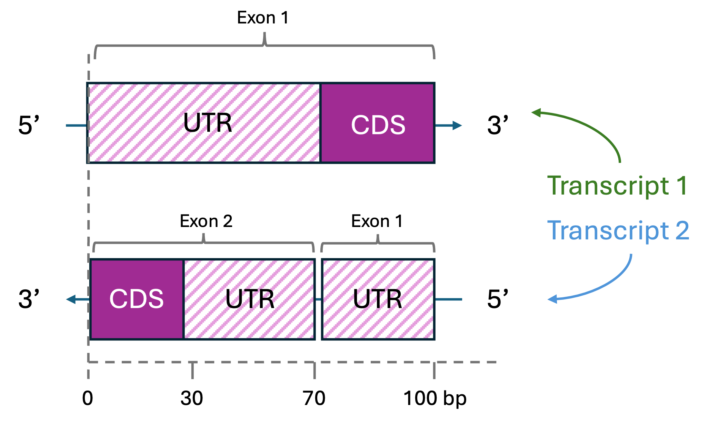

______________________________________________________________________

## icon: lucide/folder-kanban

# Annotation Guide

This package makes some high-level decisions on how to handle the annotation of UTR regions.

- A noncoding exon is an exon which contains part of the 5'UTR sequence.
- We first compile a FASTA seq by aggregating all noncoding exons together.
- We build a sequence of the first N noncoding exons of a transcript, which usually contain some CDS at the end.
- Samples without a mapped CDS start site are removed from the database.
- Focus on 5'UTR exclusively
- N-terminal extensions?
- How uORF IDs are generated?
- How are database entries handled? Are there only

# Abbreviations

- CDS
- UTR

# How are UTRs Represented in SURF-A?

{ align=left }
**Figure 1: Two example transcripts.** On top, Transcript 1 is a positive strand transcript with a single exon which is shared between the untranslated region (UTR) and the coding sequence (CDS). On bottom, Transcript 2 is a negative stand transcript with two exons. The first exon is entirely noncoding, while the second transcript is shared between the UTR and CDS.

We can also represent these trascript boundaries in table form.

| Transcript | UTR Length (bp) | Strand | Exon | Start| Stop| Rel_start | Rel_stop |
| ---------- | ----------------|--------|------|------|-----|-----------|----------|
| Transcript 1 | 70 | + | 1| 0|70|0|70|
| Transcript 2 | 70 | - | 1| 100|70|0|30|
| Transcript 2 | 70 | - | 2| 30|30|70|

**Table 1: Transcript Diagram in Table Form.** This table shows how hypothetical transcripts 1 and 2 from Figure 1 can be represented in a pure table form. The SURF-A backend converts each transcript UTR sequence into a linear mRNA FASTA sequence, where "relative start" and "relative stop" coordinates represent the index of where these regions begin/end in the mRNA FASTA sequence.
