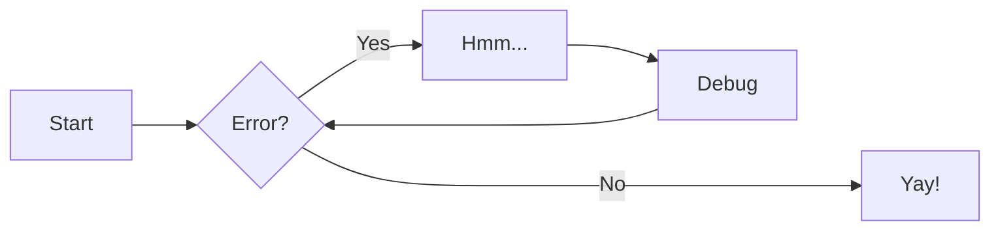

______________________________________________________________________

## icon: lucide/flask-conical

# SURF-A

SURF-A is a Python utility that allows users to annotate small upstream open reading frames (uORFs) in mRNA sequences. The tool provides a way to build a basic database of uORF sequences from any input set of Ensembl GTF and FASTA files.

## Installation

This work is in development and full PyPI hosting is coming soon. This package depends on a locally available version of Bedtools.

For development, you can install this tool locally using the following steps:

1. Install uv: (https://docs.astral.sh/uv/).
1. `uv sync` to install all required dependencies.
1. `source .venv/bin/activate` to activate the environment.

## Usage

The required inputs for the SURF-A database build are:

- An Ensembl GTF file for your organism of choice.
- A matching FASTA file (should use the same reference genome as the GTF).
- A target directory to save files.

Basic database build:

```
make_uorf_db.py \
  --gtf "Homo_sapiens.GRCh38.115.gtf.gz" \
  --fasta  'Homo_sapiens.GRCh38.dna.primary_assembly.fa' \
  --output-dir "/Users/bbowles/Documents/Code/tmp"
```

Export a JSON file for your target transcript:

```
make_json.py \
    --db uorfs.db \
    --transcript ENST00000504921.7 \
    --output uorfs.json
```

## Commands

- [`zensical new`][new] - Create a new project

- [`zensical serve`][serve] - Start local web server

- [`zensical build`][build] - Build your site

## Examples

### Admonitions

> Go to [documentation](https://zensical.org/docs/authoring/admonitions/)

!!! note

```
This is a **note** admonition. Use it to provide helpful information.
```

!!! warning

```
This is a **warning** admonition. Be careful!
```

### Details

> Go to [documentation](https://zensical.org/docs/authoring/admonitions/#collapsible-blocks)

??? info "Click to expand for more info"

```
This content is hidden until you click to expand it.
Great for FAQs or long explanations.
```

## Code Blocks

> Go to [documentation](https://zensical.org/docs/authoring/code-blocks/)

```python hl_lines="2" title="Code blocks"
def greet(name):
    print(f"Hello, {name}!") # (1)!

greet("Python")
```

1. > Go to [documentation](https://zensical.org/docs/authoring/code-blocks/#code-annotations)

   Code annotations allow to attach notes to lines of code.

Code can also be highlighted inline: `#!python print("Hello, Python!")`.

## Content tabs

> Go to [documentation](https://zensical.org/docs/authoring/content-tabs/)

=== "Python"

````
``` python
print("Hello from Python!")
```
````

=== "Rust"

````
``` rs
println!("Hello from Rust!");
```
````

## Diagrams

> Go to [documentation](https://zensical.org/docs/authoring/diagrams/)



## Footnotes

> Go to [documentation](https://zensical.org/docs/authoring/footnotes/)

Here's a sentence with a footnote.[^1]

Hover it, to see a tooltip.

\[^1\]: This is the footnote.

## Formatting

> Go to [documentation](https://zensical.org/docs/authoring/formatting/)

- ==This was marked (highlight)==
- ^^This was inserted (underline)^^
- ~~This was deleted (strikethrough)~~
- H~2~O
- A^T^A
- ++ctrl+alt+del++

## Icons, Emojis

> Go to [documentation](https://zensical.org/docs/authoring/icons-emojis/)

- :sparkles: `:sparkles:`
- :rocket: `:rocket:`
- :tada: `:tada:`
- :memo: `:memo:`
- :eyes: `:eyes:`

## Maths

> Go to [documentation](https://zensical.org/docs/authoring/math/)

$$
\\cos x=\\sum\_{k=0}^{\\infty}\\frac{(-1)^k}{(2k)!}x^{2k}
$$

!!! warning "Needs configuration"
Note that MathJax is included via a `script` tag on this page and is not
configured in the generated default configuration to avoid including it
in a pages that do not need it. See the documentation for details on how
to configure it on all your pages if they are more Maths-heavy than these
simple starter pages.

<script id="MathJax-script" src="https://unpkg.com/mathjax@3/es5/tex-mml-chtml.js"></script>

<script>
  window.MathJax = {
    tex: {
      inlineMath: [["\\(", "\\)"]],
      displayMath: [["\\[", "\\]"]],
      processEscapes: true,
      processEnvironments: true
    },
    options: {
      ignoreHtmlClass: ".*|",
      processHtmlClass: "arithmatex"
    }
  };

  document$.subscribe(() => {
    MathJax.startup.output.clearCache()
    MathJax.typesetClear()
    MathJax.texReset()
    MathJax.typesetPromise()
  })
</script>

## Task Lists

> Go to [documentation](https://zensical.org/docs/authoring/lists/#using-task-lists)

- [x] Install Zensical
- [x] Configure `zensical.toml`
- [x] Write amazing documentation
- [ ] Deploy anywhere

## Tooltips

> Go to [documentation](https://zensical.org/docs/authoring/tooltips/)

[Hover me][example]

[build]: https://zensical.org/docs/usage/build/
[example]: https://example.com "I'm a tooltip!"
[new]: https://zensical.org/docs/usage/new/
[serve]: https://zensical.org/docs/usage/preview/
