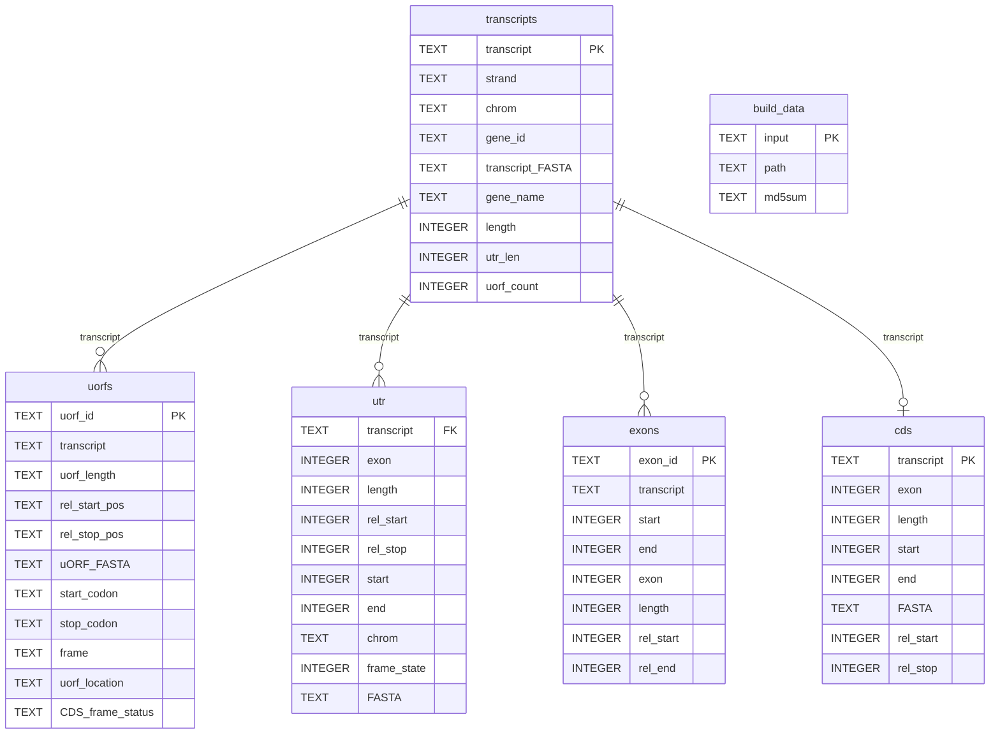

______________________________________________________________________

## icon: lucide/folder-kanban

# Database schema

The output database (`uorfs.db`) contains five tables. All tables share `transcript`
as a common join key.

## Tables

### `transcripts`

One row per transcript parsed from the input GTF.

| Column | Type | Nullable | Description |
|---|---|---|---|
| `transcript` | TEXT | No | Transcript ID including version, e.g. `ENST00000405005.8`. Primary key. |
| `strand` | TEXT | No | Strand orientation: `+` or `-`. |
| `chrom` | TEXT | No | Chromosome name, e.g. `chr1`. |
| `gene_id` | TEXT | No | Gene ID including version, e.g. `ENSG00000157168.22`. |
| `transcript_FASTA` | TEXT | No | mRNA sequence of the transcript's 5' noncoding exons. |
| `gene_name` | TEXT | No | Gene symbol. |
| `length` | INTEGER | No | Total nucleotide length of the transcript FASTA. |
| `utr_len` | INTEGER | No | Nucleotide length of the 5' UTR. |
| `uorf_count` | INTEGER | No | Number of uORFs identified in the 5' UTR. |

### `uorfs`

Upstream open reading frames identified within each 5' UTR.

| Column | Type | Nullable | Description |
|---|---|---|---|
| `uorf_id` | TEXT | No | Unique uORF identifier. Primary key. |
| `transcript` | TEXT | No | Parent transcript ID. Foreign key → `transcripts.transcript`. |
| `uorf_length` | TEXT | No | Length of the uORF in nucleotides. |
| `rel_start_pos` | TEXT | No | Index within the 5' UTR FASTA where the uORF begins. |
| `rel_stop_pos` | TEXT | No | Index within the 5' UTR FASTA where the uORF ends. |
| `uORF_FASTA` | TEXT | No | mRNA sequence of the uORF region. |
| `start_codon` | TEXT | No | Start codon of the uORF, e.g. `AUG`. |
| `stop_codon` | TEXT | No | Stop codon of the uORF, e.g. `UGA`. `NO_UTR_STOP` if the uORF reads into the CDS. |
| `frame` | TEXT | No | Reading frame (0, 1, or 2), relative to the 5' UTR FASTA start. |
| `uorf_location` | TEXT | No | Whether the uORF is fully within the 5' UTR or overlaps the CDS. |
| `CDS_frame_status` | TEXT | No | Whether the uORF is in-frame with the transcript's CDS start codon. |

### `utr`

One row per exon contributing to the 5' UTR of a transcript.

| Column | Type | Nullable | Description |
|---|---|---|---|
| `transcript` | TEXT | No | Parent transcript ID. Foreign key → `transcripts.transcript`. |
| `exon` | INTEGER | No | Exon number of the UTR sequence. |
| `length` | INTEGER | No | Length of the UTR sequence in nucleotides. |
| `rel_start` | INTEGER | No | Index within the 5' UTR FASTA where this exon begins. |
| `rel_stop` | INTEGER | No | Index within the 5' UTR FASTA where this exon ends. |
| `start` | INTEGER | No | Genomic start coordinate from the input GTF. |
| `end` | INTEGER | No | Genomic end coordinate from the input GTF. |
| `chrom` | TEXT | No | Chromosome name, e.g. `chr1`. |
| `frame_state` | INTEGER | No | CDS start index (0, 1, or 2) used to determine uORF frame relative to CDS. |
| `FASTA` | TEXT | No | DNA sequence of the 5' UTR. |

### `exons`

One row per exon containing a UTR sequence.

| Column | Type | Nullable | Description |
|---|---|---|---|
| `exon_id` | TEXT | No | Exon ID including version, e.g. `ENSE00001427522.2`. Primary key. |
| `transcript` | TEXT | No | Parent transcript ID. Foreign key → `transcripts.transcript`. |
| `start` | INTEGER | No | Genomic start coordinate from the input GTF. |
| `end` | INTEGER | No | Genomic end coordinate from the input GTF. |
| `exon` | INTEGER | No | Exon number. |
| `length` | INTEGER | No | Exon length in base pairs. |
| `rel_start` | INTEGER | No | Index of the exon start within the overall transcript FASTA. |
| `rel_end` | INTEGER | No | Index of the exon end within the overall transcript FASTA. |

### `cds`

The first CDS-containing exon for each transcript, used as the reference for uORF classification.

| Column | Type | Nullable | Description |
|---|---|---|---|
| `transcript` | TEXT | No | Transcript ID. Primary key and foreign key → `transcripts.transcript`. |
| `exon` | INTEGER | No | Exon number containing the CDS start codon. |
| `length` | INTEGER | No | Length of the CDS in nucleotides. |
| `start` | INTEGER | No | Genomic start coordinate of the CDS. |
| `end` | INTEGER | No | Genomic end coordinate of the first CDS-containing exon. |
| `FASTA` | TEXT | No | DNA sequence of the CDS. |
| `rel_start` | INTEGER | No | Index of the CDS start site within the exon FASTA. |
| `rel_stop` | INTEGER | No | End of the 5' UTR exon sequence. |

### `build_data`

Metadata on the input files used to call uORFs.

| Column | Type | Nullable | Description |
|---|---|---|---|
| `input` | TEXT | No | Name of input parameter (ie FASTA_path). |
| `path` | TEXT | Yes | Path to input file. |
| `md5sum` | TEXT | Yes | md5sum of input file. |
